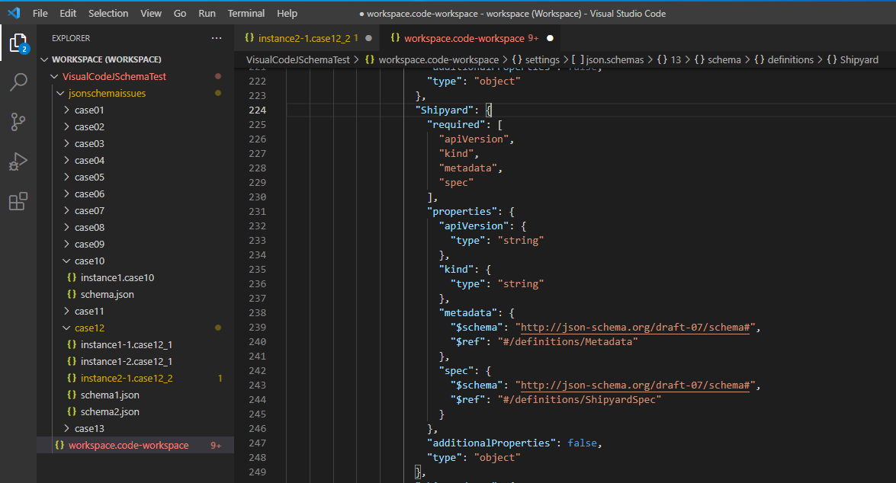
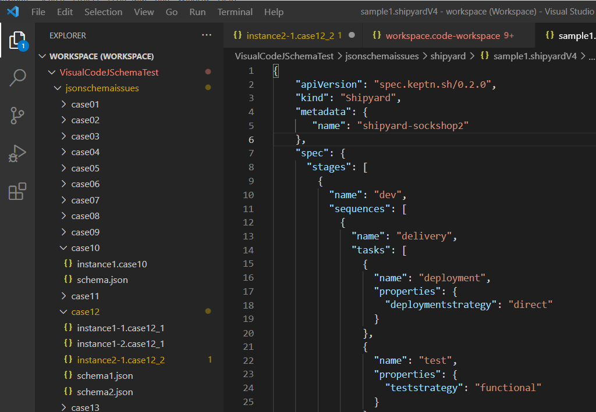
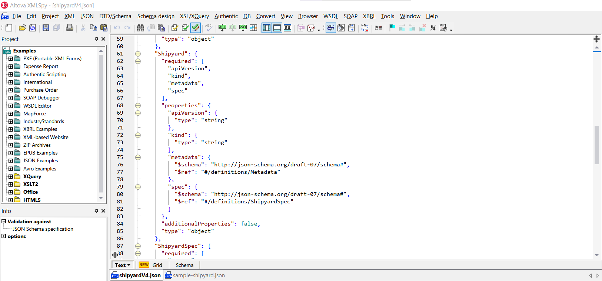
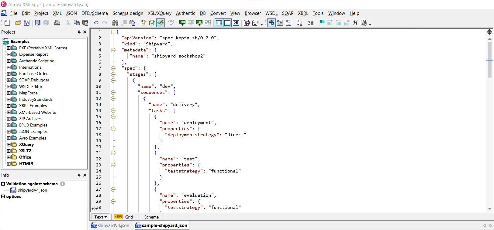
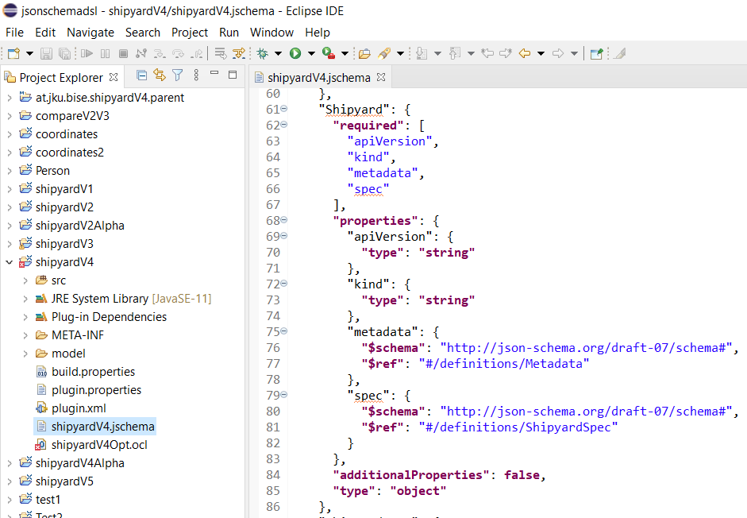
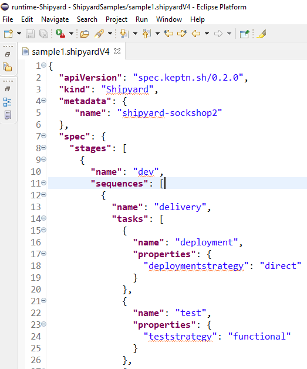
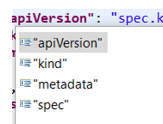
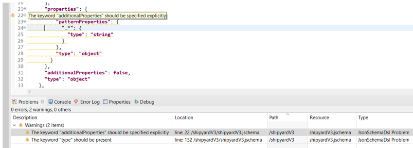
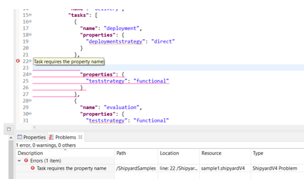

## RQ3: Comparison of existing JSON Schema editors
  
In the following table we compare Altova XML Spy Enterprise Edition 2021 rel 3, Visual Studio Code 1.56.2 and JSON Schema DSL Editor of this repository.
We compare their capabilities to edit a JSON Schema (M2) conforming to the Metaschema Draft07 (M3), and the capabilities to edit a JSON Instance (M1) conforming to a JSON Schema (M2).

  
| Feature                                                     | T1/S | T1/I | T2/S | T2/I | T3/S | T3/I |
|-------------------------------------------------------------|------|------|------|------|------|------|
| Keyword highlighting                                        | N    | N    | N    | N    | Y    | Y    |
| Content assist                                              | Y    | Y    | Y    | Y    | Y    | Y    |
| Validation                                                  | Y    | Y    | Y    | Y    | Y    | Y    |
| Inline validation                                           | Y    | Y    | Y    | Y    | Y    | Y    |
| Custom validation                                           | N    | N    | N    | N    | Y    | Y    |
| Graphical Representation                                    | Y    | Y    | N    | N    | N    | N    |
 

|     |	                                                       |
|-----|--------------------------------------------------------|
| T1/S| Altova Editor for JSON Schema 07                       |  
| T1/I| Altova Editor for JSON documents conforming to a given of JSON Schema             | 
| T2/S| Visual Studio Code Editor for JSON Schema 07           |  
| T2/I| Visual Studio Code Editor for JSON documents conforming to of JSON Schema |  
| T3/S| JSON Schema DSL for JSON Schema 07                     |   
| T3/I| JSON Schema DSL for JSON documents conforming to JSON Schema           |   

 
### Keyword highlighting

#### Visual Studio Code

Visual Studio Code does not highlight the Metaschema keywords (keywords defined in metaschema.json). As shown in the next picture, the Meta Schema keywords 
"required", "properties", "type", "additionalProperties", "$schema", "$ref" and "additionalProperties" are not treated with any difference with respect to 
"apiVersion", "kind", "metadata" and "spec" that are the keys that are being defined in this schema.
Only the basic JSON syntax highlighting, to distinguish between keys and values, is provided.

 

When editing a JSON conforming to a given JSON Schema, Visual Studio Code does not highlight the keywords defined in the JSON Schema.
For example in the next screenshot it can be seen that  "apiVersion", "kind", "metadata" and "spec", that are defined in the previous screenshot, so they are keywords of the defined language,
are treated in the same way as "deploymentstrategy" and "teststrategy"  that are not defined in the language. 

 

#### Altova

It can be observed the same behavior with Altova, as in Visual Studio Code. In the following two screenshots we show the same cases with Altova.

 

 

#### JSON Schema DSL

The JSON Schema Editor of this repository highlights the keywords defined in the Metaschema.json draft 07.
In the following screenshot can be seen the keywords "required", "properties", "type", "$schema", "$ref" and "additionalProperties" are correctly highlighted.
The keys "Shipyard", "apiVersion", "kind", "metadata" and "spec", as are not part of the metaschema, so they are correctly not highlighted.

 

When editing a JSON conforming to a JSON Schema, JSON Schema DSL highlights the keywords defined in the JSON Schema. In the following screenshot it can be seen
that "apiVersion", "kind", "metadata", "name" and "spec" are properly highlighted because they are defined in the Schema  shown in the previous screenshot 
("name" is not shown in the screenshot).

When in the JSON are used keys that are not defined in the schema they are correctly no highlighted.
As an example it can be seen that the key "deploymentstrategy" and "teststrategy" are not highlighted.

 

### Content assist
As well as Altova XML SPY and Visual Studio Code, JSON Schema DSL provides content assist for both editing of a JSON Schema, and a JSON Instance conforming to a JSON Schema,
as shown in the following two screenshots.

 

 

### Validation and Inline validation
As well as Altova XML SPY and Visual Studio Code, JSON Schema DSL provides in line validation and a more detailed description of the problems occurred.
In the following two screenshots, it can be seen that the feature is provided for both the JSON Schema Editor and the editor for the JSON conforming to the created schema. 

 

 
 

### Custom Validation.
Altova XML SPY and Visual Studio Code only offer the validation supported by JSON Schema.
There is no possibility to add custom validation for the concrete domain of the language under design.
With JSON Schema DSL, as both JSON Schema and the conforming JSONs are treated as Ecore models, it is possible to add more ocl validation rules, 
to the ocl file that is loaded by the Xtext Grammar as explained in [Language Editor generator](tutorials/LanguageEditorGeneration.pdf), in steps 19 and 20. 

### Graphical Representations.
Altova XML SPY provides a graphical representation for JSON Schemas and for all the JSON conforming to them.
Visual Studio Code does not.
JSON Schema DSL does not so far, but as JSON and JSON Schemas are treated as models, we plan in the future to apply the knowledge of MDE in this area (e.g., SIRIUS)
 

