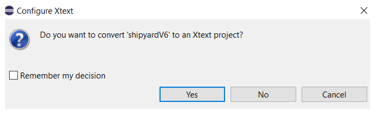
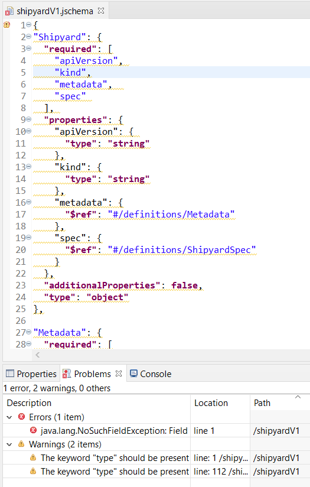
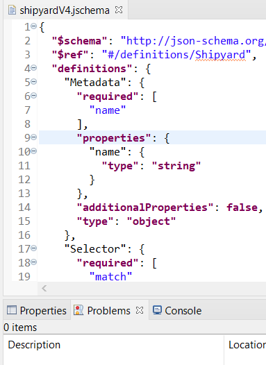

# JSON Schema DSL

JSON Schema DSL is a model-driven language engineering approach for JSON Schema that aims at bridging [JSON Schema](https://json-schema.org/) and Ecore (see Eclipse Modeling Framework [EMF](https://www.eclipse.org/modeling/emf/). 
The approach is published at [MODELS 2021](https://conf.researchr.org/home/models-2021) [1]

[1] A. Colantoni, A. Garmendia, L. Berardinelli, and M. Wimmer, “Leveraging Model-Driven Technologies for JSON Artefacts: The Shipyard Case Study,” New York, NY, USA, 2021. doi: XYZ.

## Introduction

With JSON's increasing adoption, the need for structural constraints and validation capabilities led to JSON Schema, a dedicated meta-language to specify languages which are in turn used to validate JSON documents. 
The standardisation process of JSON Schema as well as the implementation of adequate tool support (e.g., validators and editors) are work in progress. 
The periodic issuing of newer JSON Schema drafts makes tool development challenging. Nevertheless, many JSON Schemas as language definitions exist, but JSON documents are still mostly edited in basic text-based editors.   

In order to tackle this challenge, we investigate in this paper how Model-Driven Engineering (MDE) methods for language engineering can help in this area. 
Instead of re-inventing the wheel of building up particular technologies directly for JSON, we investigate how the existing MDE infrastructures may be utilized for JSON. 
In particular, we present a bridge between the JSONware and modelware, chosing EMF as the reference target technical space, to exchange languages and documents. 

Based on this bridge, our approach helps 
- language engineers in defining new domain-specific languages (DSL) as schemas and, then, JSON Schema as meta-language (i.e., playing the same role of Ecore in EMF),
- domain experts in editing (i.e., modeling) and validating schema instances conforming to a given schema,
- tool providers in generating tool support like editors and validators for any JSON documents (i.e., metaschema drafts, schemas, and schema instances)
 
The approach is transparent to JSON users: it preservs the native JSON concrete syntax and, as a result, compatibility of resulting JSON artifacts (i.e., JSON models) with existing JSON-based and MDE-agnostic tools.

We evaluate our approach with Shipyard, a JSON Schema-based language for workflow specification for Keptn, an open source tool for DevOps automation of cloud-native applications.

## Installation

An installation guide is available [here](tutorials/JSchemaDSLInstallationTutorial.pdf)

## JSON Schema DSL Examples.
Once you have complete the installation, you can open it and start working.

In the folder /samples/shipyardSchemas,  different versions of the [Shipyard](https://github.com/keptn/spec/blob/master/shipyard.md) JSON Schema can be found.
As a practice, a new simple project can be created for each version in the installed Eclipse .  Create a new file inside it, with the same name and extension (.jschema). You will asked 
if you want to convert your project in an Xtext project. Click Yes.

  

Copy the content of the file you chose in the newly created file. You will see the keyword highlighted, the in line validation errors and warnings. 
Open the Eclipse problems view to see the details of both error and warnings.  In the figure below you can see the example shipyardV1.jschema with an error (not gently reported) 
due to the "$ref" keywords have a wrong JSON Pointer, and two warnings. 

 

Repeating the steps for shipyadV4.jschema you will see that everything is correct, with no errors or warnings.

 

In this last case, when you saved the file, a folder model has been created with the genertated artifacts (shipyardV4.jsongrammar, shipyardV4.xmi, shipyardV4Opt.ecore). 
To see them, maybe the folder model has to be refreshed. Under the root project folder, a fourth artifact (shipyardV4Opt.ocl) has been created. Maybe the project folder need to be refreshed to see it.
If you open the ocl file, it will report error, because the generated ecore metamodel has not been registered.  
To do this, switch to the ATL perspective, then right click on the generated ecore metamodel and select "Register Metamodel". If you had already opened the ocl file, you have to close and open it again.
Maybe it takes some time to synch. But it does not matter, because it will be registered by the language that is going to be generated, as described in the next step.

Try to create a new project from scratch, to test the content assist (CTRL+space). To test code completion, remind that every keyword start with double quotes ("). 

## Language generation

Once as a Language Engineer, you fixed all the errors, and you are satisfied with the generated ecore metamodel, you can generate the editor for the language defined by the .jschema artifact.
To achieve this, follow the steps described in [Language Editor generator](tutorials/LanguageEditorGeneration.pdf).

Once generated the the language, and launched the runtime as explained in the Language Editior Generation tutorial, you can create your instances conforming to the .jschema.
Create a new sample project in the runtime Eclipse, create in it a new file with the extension of the language (e.g., .shipyardV4), answer Yes when asked if you want to convert it to an Xtext project,
open the file, and you have available the content assist and the validation for the generated language.
If you created the editor for shipyardV4, you can try two samples available in the folder /samples/shipyardSchemas/shipyardV4/instanceExamples.
The [Language Editor generator](tutorials/LanguageEditorGeneration.pdf) tutorial, also explain how to open an instance with the Reflective Editor, and see an instance as a model.

