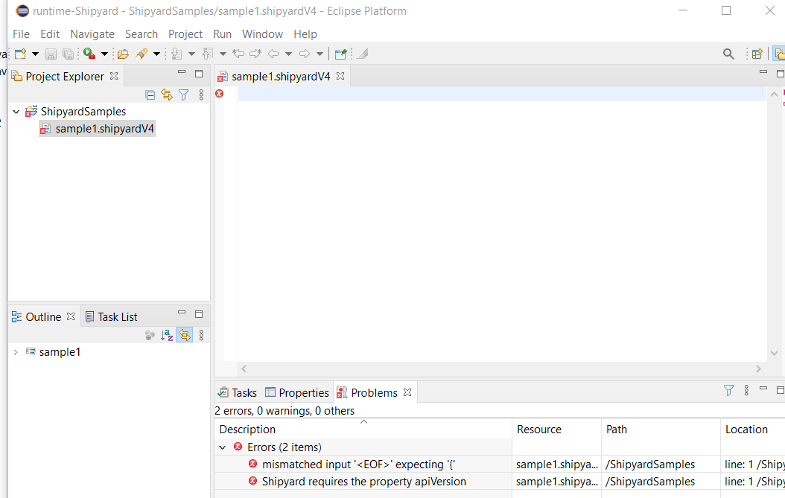
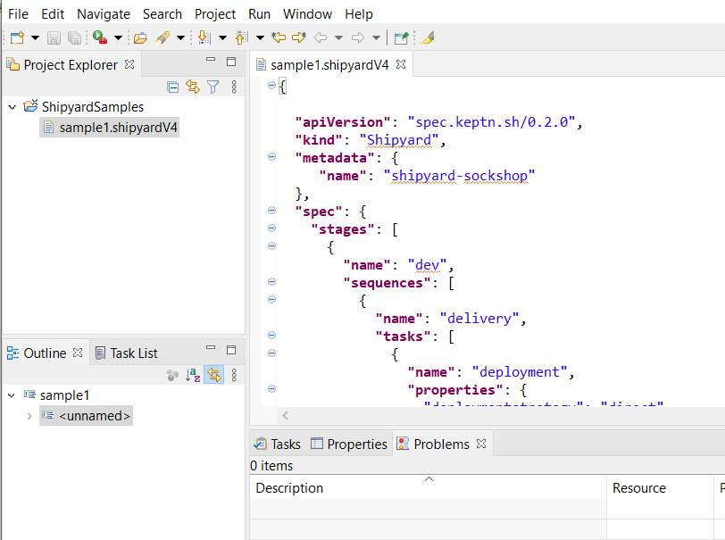
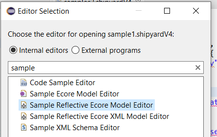
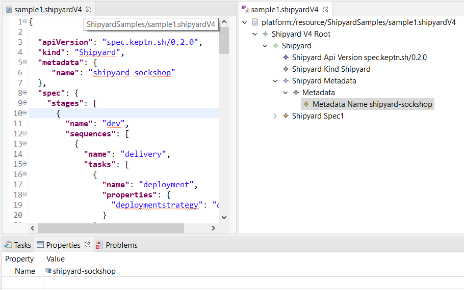

# JSON Schema DSL

JSON Schema DSL is a model-driven language engineering approach for JSON Schema that aims at bridging [JSON Schema](https://json-schema.org/) and Ecore (see Eclipse Modeling Framework [EMF](https://www.eclipse.org/modeling/emf/). 
The approach is published at [MODELS 2021](https://conf.researchr.org/home/models-2021) [1]

[1] A. Colantoni, A. Garmendia, L. Berardinelli, and M. Wimmer, “Leveraging Model-Driven Technologies for JSON Artefacts: The Shipyard Case Study,” New York, NY, USA, 2021. doi: XYZ.

## Introduction

With JSON's increasing adoption, the need for structural constraints and validation capabilities led to JSON Schema, a dedicated meta-language to specify languages which are in turn used to validate JSON documents. 
The standardisation process of JSON Schema as well as the implementation of adequate tool support (e.g., validators and editors) are work in progress. 
The periodic issuing of newer JSON Schema drafts makes tool development challenging. Nevertheless, many JSON Schemas as language definitions exist, but JSON documents are still mostly edited in basic text-based editors.   

In order to tackle this challenge, we investigate in this paper how Model-Driven Engineering (MDE) methods for language engineering can help in this area. 
Instead of re-inventing the wheel of building up particular technologies directly for JSON, we investigate how the existing MDE infrastructures may be utilized for JSON. 
In particular, we present a bridge between the JSONware and modelware, chosing EMF as the reference target technical space, to exchange languages and documents. 

Based on this bridge, our approach helps 
- language engineers in defining new domain-specific languages (DSL) as schemas and, then, JSON Schema as meta-language (i.e., playing the same role of Ecore in EMF),
- domain experts in editing (i.e., modeling) and validating schema instances conforming to a given schema,
- tool providers in generating tool support like editors and validators for any JSON documents (i.e., metaschema drafts, schemas, and schema instances)

The approach is transparent to JSON users: it preservs the native JSON concrete syntax and, as a result, compatibility of resulting JSON artifacts (i.e., JSON models) with existing JSON-based and MDE-agnostic tools.

We evaluate our approach with Shipyard, a JSON Schema-based language for workflow specification for Keptn, an open source tool for DevOps automation of cloud-native applications.

## Installation

The latest version of the installation guide is available [here](tutorials/JSchemaDSLInstallationTutorial.pdf)

## Examples.
This section introduces a list of working examples. The list is continuously updated.

### Hello World examples. 
Trivial examples are available. Their are listed in the following folder:
- [jsonschemadsl2ecore.trafo.opt/test](jsonschemadsl2ecore.trafo.opt/test)

Such trivial examples will help you to understand the overall approach and its steps, as documented in [1]. In each subfolder, you can find a json schema (with extension.jschema) and the artifacts that will be generated from it by JsonSchemaDSL

### Shipyard DSL.
Shipyard is a JSON Schema-based domain-specific language (DSL) for workflow specification for [Keptn](https://keptn.sh/), an open source tool for DevOps automation of cloud-native applications.  The  results  of  the  case study  show  that  proper  editors  as  well  as  language  evolution support  from  MDE  can  be  reused  and  at  the  same  time,  the surface  syntax  of  JSON  is  maintained. See [1] for further details.

Different Shipyard DSL versions are available in [samples/shipyardSchemas/](samples/shipyardSchemas/), collected from the Shipyard official [Keptn repository](https://github.com/keptn/spec/blob/master/shipyard.md).
The Shipyard DSL is orginally defined by schema document, which, in turn, conforms to a given metaschema or [JSON Schema Draft](https://json-schema.org/). The JSON Schema is a draft standard by IETF, New JSON Schema Drafts are issued by IETF every six months. Our approach [1] supports the [JSON Schema Draft 7](https://json-schema.org/).

In the following, we apply the approach proposed in [1] to Shipyard. The following steps (1-10) are typically performed by a Language Engineer.

#### Steps 1-6

1. Choose a Shipyard version among the ones made available (e.g., shipyardV1.json );
2. Create a Simple Project; 
3. Create a new file within the newly created Project with .jschema file extension (e.g. shipyardV1.jschema). 
4. You will be asked whether you want to convert your project in an Xtext project. Click Yes.

  

5. Copy the content Shipyard version chosen at step 1  in the newly created file. You will see the keywords highlighted, the in line validation errors and warnings. 
6. Open the  Problems view to see the details of both error and warnings.  In the figure below, you can see the example shipyardV1.jschema with an error due to mistyped "$ref"  value (it has to be a correct [JSON Pointer](https://datatracker.ietf.org/doc/html/rfc6901) string) , and two warnings. 

 

We invite the reader to repeat steps from 1. to 6. choosing the *shipyardV4.json* at step 1. 
At the end of step 6, everything will be correct, with no errors or warnings.

 

#### Steps 7-10
*(after choosing shipyardV4.json at step 1)*

7. Save the shipyardV4.jschema. 
9. A folder /model will be created including the following artifacts: shipyardV4.jsongrammar, shipyardV4.xmi, shipyardV4Opt.ecore. If you do not see the /model folder or it is empty, please refresh the /model or the whole peoject folder. 

10. Under the root project folder, a fourth artifact (shipyardV4Opt.ocl) is created. Refresh the project folder if the OCL artifact does not appear. Open the ocl file. Fix the reported error by registering the ecore metamodel generated from the shipyardV4.jschema artifact. For registering the generated metamodel, switch to the ATL perspective, then right click on the generated ecore metamodel and select "Register Metamodel". If you had already opened the ocl file, you have to close and open it again.  Wait a while for the synchrnizaation process to be completed. 

#### Tip 1
We invite the reader to practice with other shipyard versions. Not all versions of shipyard are valid json schema, as explained in [1]. 
They can be considered a good base to experiment autonomously, as well as the tests in 
[jsonschemadsl2ecore.trafo.opt/test](jsonschemadsl2ecore.trafo.opt/test)

#### Tip 2
We invite the reader to create her/his own json schemas and repeat the entire cycle. 

#### Tip 3
The generated DSL editors are provided with content assist features. Press CTRL+space while typing.

#### Known limitations
Note that so far JsonSchemaDSL is a prototype, and it does not support the generation of the artifacts for all the JSON Schema keywords.
The list of supported keywords/feature so far is available in [FEATURES_LIST.md](FEATURES_LIST.md)

## Tool support : DSL editor generation.

Once completed steps 1-9, the EMF/Xtext-based editor for the DSL defined by the .jschema artifact can be generated, following the steps in the [Language Editor generator](tutorials/LanguageEditorGeneration.pdf) tutorial. Once launched the runtime eclipse as explained in the [tutorial](tutorials/LanguageEditorGeneration.pdf) the reader can perform the following steps, described in term of the *shipyardV4.jschema* example previoulsy explained.

11.  create a new general project with the New Project wizard
12.  create a file with the extension you chose in the language editor creation(e.g., shipyardV4)
13.  You will be asked if you want to convert the project to an XText project. Answer YES
14.  Open your file
15.  Open the Problems and Properties view to see more details
16.  Use CTRL+space for the content assist and code completion. Remember that all the keywords are between double quotes (“)

17. For the shipyardV4.jschema example use in this tutorial you can try json instance examples in  
[samples/shipyardSchemas/shipyardV4/instanceExamples](samples/shipyardSchemas/shipyardV4/instanceExamples) where you will find *sample1.shipyardV4* and *samples2.shipyardV4*.

In the screenshot below you can see an excerpt of sample1.shipyardV4.

### Sample Reflective Ecore Model Editor	
18. Right click on the file with the extension that you have created (e.g., sample1.shipyardV4) 
19. Select open with -> other.
20. Choose the Sample Reflective Ecore Model Editor and click OK. 

21. Wait some second and you will see the tree editor for your file, that is a model.
22. Open the view properties, to see more details when you select an element of the tree.

As shown in the screenshot below, you can see sample1.shipyardV4 as a json conforming to the shipyardV4.jschema or as a model conforming to the previously generated shipyardV4Opt.ecore.

Changes applied to the tree are reflected in the file json style and vice versa.

